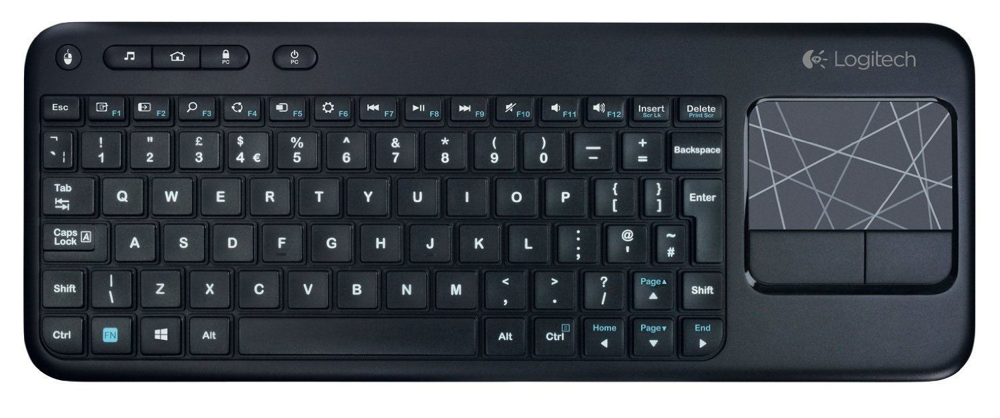

# Keyjacking the Logitech K400

## Purpose

Keyjacking the Logitech K400 to prove securtiy issues with wireless input devices, and use Logitech dongle for our IMU mouse (WIP).

## Project struture

### .vscode
Contains file to build and verify arduino code (beacause no one should use the Arduino IDE)

`⇧⌘B` to verify code currently.

### images
Images for the README

### sniffer_24
Arduino source code used to sniff 2.4GHz devices and attack keyboard.
WIP

## How does this work ?
I will be using the Logitech K400 for this keyjack, it is interesting because it supports both mouse and keyboard.

### Identitfying the chip
First thing to do is to identify the chip in the keyboard :

As most wireless input devices we have a nrf24 chip here. We will be able to listen to it (after some work). This is the aim of the `sniffer_24` code.

## Sources 
nRF24L01 datasheet : https://www.nordicsemi.com/chi/content/download/2730/34105/file/nRF24L01_Product_Specification_v2_0.pdf